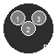

# Dragclickable v1.0

A professional Python GUI application for automated clicking with draggable circles and global hotkey controls.



## ✨ Features

- 🖥️ **Screen Capture**: Capture your current screen for positioning
- 🎯 **Draggable Circles**: Unlimited draggable circles that you can position anywhere
- ⚡ **Auto-Clicking**: Automated clicking with customizable cycle count
- ⌨️ **Global Hotkeys**: 
  - Press `Y` to start clicking
  - Press `N` to stop clicking
- 📍 **Default Positions**: Circles start at your exact working coordinates
- 📊 **Real-time Status**: Live status updates and logging
- 💾 **Save/Load Positions**: JSON support for saving and loading circle configurations
- ⚙️ **Click Settings**: Double-click support and customizable click speed
- 🎨 **Professional UI**: Clean, modern interface with custom icon

## Installation

1. Install Python 3.7 or higher
2. Install dependencies:
   ```bash
   pip install -r requirements.txt
   ```

## Usage

1. Run the application:
   ```bash
   python dragclickable_v1.py
   ```

2. **Setup Process**:
   - Click "Capture Screen" to take a screenshot
   - Click "Create 5 Circles" to create draggable circles
   - Drag circles to your desired positions
   - Set click count (number of cycles)
   - Click "Start Clicking" or press `y` to begin

3. **Controls**:
   - **Start**: Press `y` key or click "Start Clicking" button
   - **Stop**: Press `n` key or click "Stop" button
   - **Drag**: Click and drag circles to reposition them

## Default Circle Positions

The circles are pre-positioned at these screen coordinates:
- Circle 1: (739, 954)
- Circle 2: (801, 954) 
- Circle 3: (864, 954)
- Circle 4: (924, 952)
- Circle 5: (984, 954)

## Requirements

- Python 3.7+
- opencv-python
- pyautogui
- Pillow
- keyboard
- numpy

## 🎮 Usage Examples

### Basic Setup
1. **Capture Screen**: Click "Capture Screen" to take a screenshot
2. **Create Circles**: Click "Create 5 Circles" for default positions
3. **Add More**: Use "Add Extra Circle" for additional click points
4. **Position**: Drag circles to your desired locations
5. **Configure**: Set click count and speed settings
6. **Start**: Press `Y` or click "Start Clicking"

### Advanced Features
- **Save Configurations**: Use "Save Positions" to save your setup
- **Load Configurations**: Use "Load Positions" to restore saved setups
- **Default Positions**: Use "Load Default Positions" for quick setup
- **Keybinds**: Click "Keybinds" to view hotkey information

## 📁 Project Structure

```
dragclickable-v1/
├── dragclickable_v1.py           # Main application
├── dragclickable_icon.png        # Application icon
├── default_positions.json        # Default circle positions
├── requirements.txt              # Python dependencies
├── README.md                     # This file
└── .gitignore                    # Git ignore file
```

## 🔧 Configuration

### JSON Position Format
```json
[
  {
    "circle_number": 1,
    "screen_x": 739,
    "screen_y": 954,
    "canvas_x": 0,
    "canvas_y": 0
  }
]
```

### Click Settings
- **Double Click**: Enable/disable double clicking
- **Click Speed**: Set delay between clicks (in milliseconds)
- **Click Count**: Number of complete cycles to perform

## 🚀 Quick Start

```bash
# Clone the repository
git clone https://github.com/yourusername/dragclickable-v1.git
cd dragclickable-v1

# Install dependencies
pip install -r requirements.txt

# Run the application
python dragclickable_v1.py
```

## 📋 Requirements

- Python 3.7+
- opencv-python
- pyautogui
- Pillow
- keyboard
- numpy

## 🎯 Use Cases

- **Gaming**: Automated clicking for games
- **Testing**: UI testing and automation
- **Productivity**: Repetitive clicking tasks
- **Accessibility**: Assistive clicking for users with disabilities

## 📝 Notes

- Global hotkeys work system-wide (even when window not focused)
- Circles are automatically scaled to fit your screen resolution
- Click count represents the number of complete cycles (all circles clicked once per cycle)
- Supports unlimited number of circles
- Professional icon and modern UI design

## 🤝 Contributing

1. Fork the repository
2. Create a feature branch (`git checkout -b feature/amazing-feature`)
3. Commit your changes (`git commit -m 'Add some amazing feature'`)
4. Push to the branch (`git push origin feature/amazing-feature`)
5. Open a Pull Request

## 📄 License

This project is licensed under the MIT License - see the [LICENSE](LICENSE) file for details.

## ⭐ Support

If you find this project helpful, please give it a star! ⭐